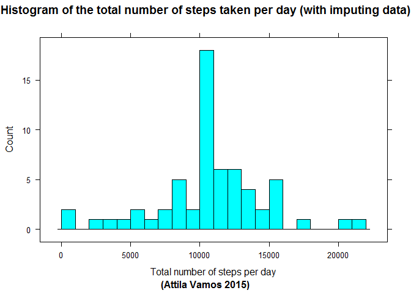

# Reproducible Research Course Peer Assignment 1
Attila Vamos  
Friday, March 15, 2015  
## Introduction
It is now possible to collect a large amount of data about personal movement using activity monitoring devices such as a Fitbit, Nike Fuelband, or Jawbone Up. These type of devices are part of the "quantified self" movement - a group of enthusiasts who take measurements about themselves regularly to improve their health, to find patterns in their behavior, or because they are tech geeks. But these data remain under-utilized both because the raw data are hard to obtain and there is a lack of statistical methods and software for processing and interpreting the data.

This report makes use of data from a personal activity monitoring device. This device collects data at 5 minute intervals through out the day. The data consists of two months of data from an anonymous individual collected during the months of October and November, 2012 and include the number of steps taken in 5 minute intervals each day.

## Libraries
The following libraries were used throughout the code.

```r
library(lattice)
library(knitr) 
```

## Loading and preprocessing the data

Un-comment and change next line to adopt code into your environment

```r
#setwd("v:/Tutorials/Stanford University On-Line Courses/Reproducible Research/Peer Assessment 1/")
```


## Activity 1: Loading and preprocessing the data


Load activity.csv if it is not loaded yet.


```r
if(!exists("Activity"))
{
  print("Load activity.csv...")
  Activity <- read.csv("activity.csv")
}else
{
  print("activity.csv already loaded...")
}
```

```
## [1] "activity.csv already loaded..."
```

***
## Activity 2: What is mean total number of steps taken per day?

remove NA rows

```r
Activity_filtered <- Activity[! is.na(Activity$steps),]
```

Aggregate the Activity data set steps filed by value of date field to calculate total steps taken per day 

```r
StepsPerDay <- aggregate(list(dailySteps=Activity_filtered$steps), list(date=Activity_filtered$date), FUN=sum )
```
Generate histogram from the aggregated data

```r
histogram(StepsPerDay$dailySteps, breaks=20, type="count", main = "Histogram of the total number of steps taken per day", sub="(Attila Vamos 2015)", xlab="Number of steps per day", ylab="Count" )
```

 

Calculate mean and median of the total number of steps taken per day

```r
MeanStepsPerDay <- mean(StepsPerDay$dailySteps)
```

```
## [1] "The mean of the total number of steps taken per day: 10766"
```

```r
MedianStepsPerDay <- median(StepsPerDay$dailySteps)
```

```
## [1] "The median of the total number of steps taken per day: 10765"
```

***
## Activity 3: What is the average daily activity pattern?

Aggregate the Activity data set steps filed by value of interval field to calculate average number of steps taken per interval 

```r
AverageStepsPerInterval <- aggregate(list(averageSteps=Activity_filtered$steps), list(interval=Activity_filtered$interval), FUN=mean )
```

Generate a plot from the aggregated data:

```r
plot(y=AverageStepsPerInterval$averageSteps, type='l', ylab = "Average number of steps", xlab = "Interval (measured in 5 minutes unit in HHMM format)", x=AverageStepsPerInterval$interval, main="Daily activity pattern", sub="(Attila Vamos 2015)")
```

 

Unfortunately this plot is not correct. The R plot() function uses the Values of interval variable (the intervals) as a continuous values, but it doesn't that. There is gap between 55 and 100 (which is originally 0:55 and 1:00 as time value) and every interval follows the x55. To check this problem, lets enlarge a part of this data set. Draw a plot from AverageStepsPerInterval data set between 800 and 1000 ( aka 08:00 and 10:00)

 

On this diagram there are a linear approximation between 855 and 900 as well as 955 and 1000. We have not data for 860, 865, etc intervals, therefore this plot and the previous one as well are not valid. They are contains artificial values.
To proper plotting I generate a real time series from the interval values.

```r
AverageStepsPerInterval$intervalTime <- strptime(sprintf("%04d", as.numeric(AverageStepsPerInterval$interval)), format="%H%M")
```
Plot the intervals average values using intervalTime variable

```r
plot(y=AverageStepsPerInterval$averageSteps, type='l', ylab = "Average number of steps", xlab = "Interval (measured in 5 minutes unit in 'HH:MM' time format)", x=AverageStepsPerInterval$intervalTime, main="Daily activity pattern", sub="(Attila Vamos 2015)")
```

 

To search which interval contains the maximum value, I used the max() function 

```r
MaxAverageStepsInterval <- AverageStepsPerInterval[AverageStepsPerInterval$averageSteps == max(AverageStepsPerInterval$averageSteps),"interval"]
```


```
## [1] "Max avereage steps interval is: 835 (started at 8:35 )"
```

***
## Activity 4: Imputing missing values


```r
NumberOfMissingData <- length(Activity[is.na(Activity$steps),"steps"])
```

```
## [1] "Number of missing data row is: 2304"
```

I choose to fill the missing data with the relevant average steps per interval value calculated in the previous activity

```r
Activity_Filled <- Activity

Activity_Filled$steps <- ifelse(is.na(Activity_Filled$steps), AverageStepsPerInterval[AverageStepsPerInterval$interval %in% Activity_Filled$interval,"averageSteps"], Activity_Filled$steps)
```

Aggregate the Activity_Filled data set steps field by value of date field to calculate total number of steps taken per day. 


```r
StepsPerDay2 <- aggregate(list(dailySteps = Activity_Filled$steps), list(date = Activity_Filled$date), FUN=sum )
StepsPerDay2$DateTime <- as.POSIXlt(paste( StepsPerDay2$date), format = "%Y-%m-%d")
```

Histogram

```r
histogram(StepsPerDay2$dailySteps, breaks=20,  type="count", main = "Histogram of the total number of steps taken per day (with imputing data)", sub="(Attila Vamos 2015)", xlab="Total number of steps per day", ylab="Count" )
```

 

```r
MeanStepsPerDay2 <- mean(StepsPerDay2$dailySteps)
```

```
## [1] "The mean of the total number of steps taken per day (after imputing missing values) is: 10766"
```

```r
MedianStepsPerDay2 <- median(StepsPerDay2$dailySteps)
```

```
## [1] "The median of the total number of steps taken per day (after imputing missing values) is: 10766"
```

### What is the impact of imputing missing data on the estimates of the total daily number of steps?

 |Original|imputed|compared|
------|--------|-------|--------|
mean|10766|10766|0|
median|10765|10766|+1|

Maybe I'm wrong, but I'm not too surprised about the mean and median didn't changed because I used to replace NA values with the relevant mean values .


***
## Activity 5: Are there differences in activity patterns between weekdays and weekends?

Convert date file of Activity_Filed data set to POSIX DateTime object

```r
Activity_Filled$DateTime <- as.POSIXlt(paste( Activity_Filled$date), format = "%Y-%m-%d")
```

Determine the weekday from the DataTime variable

```r
Activity_Filled$Day <- weekdays(Activity_Filled$DateTime)
```

Finally flag the weekdays and the weekend days.

```r
Activity_Filled$DayType <- factor(ifelse(Activity_Filled$Day %in% c("Saturday", "Sunday"), "Weekend", "Weekday"))
```

Aggregate the steps variable with mean function by activity intervals and day type (Weekend/weekday).

```r
AverageStepsPerInterval2 <- aggregate( list( averageSteps = Activity_Filled$steps), list(interval = Activity_Filled$interval, dayType = Activity_Filled$DayType), FUN=mean )
```

Created plots in two rows. In this placement the intervals are same horizontal place and the weekdays/weekend activity easily comparable.


```r
xyplot(AverageStepsPerInterval2$averageSteps ~ AverageStepsPerInterval2$interval | AverageStepsPerInterval2$dayType, layout = c(1, 2), type = "l", xlab = "Time interval", ylab = "Number of steps", main = "Time series of number of steps vs time interval", sub="(Attila Vamos 2015)")
```

 

Unfortunately this plot isn't correct!

The xyplot() is in trouble with the value of the original interval variable, because it isn't contain continuous values. It has a big gap after every x55 value (where x: 0, 1, 2..22), based on this is a composit value comes from the hour and the minute values. This gap or hop from 55 to 100 and so on causes a slope, an artificial noise on the graph. xyplot() linearly interpolate plot the values and draw a line from the value of interval 55 and 100. This distorts the diagram.

I calculate a minute values from the interval and used this variable to generate graphs.

```r
AverageStepsPerInterval2$interval2 <-  60 * trunc(AverageStepsPerInterval2$interval / 100) + AverageStepsPerInterval2$interval %% 100
```

If we check an enlarged part of the diagram e.g. between 800 and 1000 ( 8:00 and 10:00) plotted with the interval variable, then there is the problem between 855 and 900 as well as 955 and 1000 and so on:
 

And the same enlarged part using the interval2 variable is:
 

Created another plots but use interval2 variables (which is now a continuous series)

```r
xyplot(AverageStepsPerInterval2$averageSteps ~ AverageStepsPerInterval2$interval2 | AverageStepsPerInterval2$dayType, layout = c(1, 2), type = "l", xlab = "Time interval", ylab = "Number of steps", main = "Time series of number of steps vs time interval2", sub="(Attila Vamos 2015)" )
```

 

